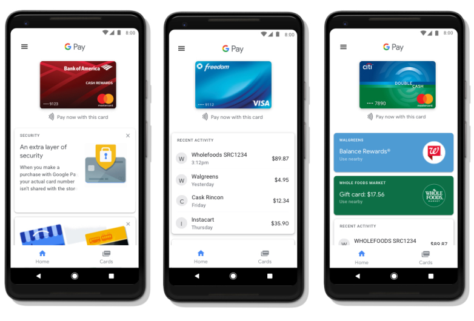
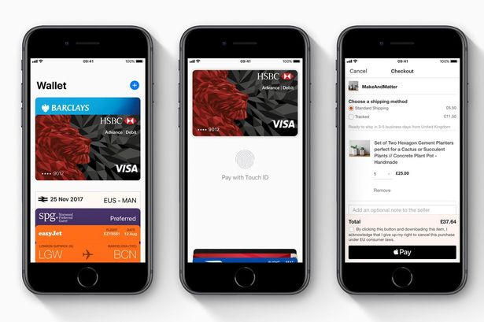

# Quero Code
Equipe 10 - Movile HACK 

Fevereiro de 2018 - São Carlos

---

## Desafio
## Melhorar digital wallets

---

## Como melhorar digital wallets?

Digital wallets são bacanas. Nos ajudam a pagar comida, controlar os gastos.

---

## Como melhorar digital wallets?

Mas ainda perdem para cartão (plástico) e dinheiro em alguns aspectos.

---

## Cartão:
- offline
  - o usuário não precisa de celular ou internet
- acesso
  - debito pré-pago alcança desbancarizados

---

## Papel-moeda:
- realmente offline
- privacidade

---

## Como melhorar digital wallets?

Andando em qualquer direção que tornem as areas deficientes melhores.

---

## Hackathon

Para este hackathon, nossa equipe pensou em alguns destes pontos que poderiam ser melhorados se as 
digital wallets tivessem a funcionalidade de....

---

## Emissão de vouchers!!

<small>voucher by Nugraha Wira Menggala from the Noun Project</small>

---

## Casos de uso

- Pai quer pagar a merenda do filho
- Pessoa quer sair de casa sem celular
- Pessoa quer transferir saldo para pessoas que não possuem a app

Note:
## Wallets de hoje

## Wallets de hoje

---

## Demo

---

## Modelo de negócio

- cobrar taxas
- vender serviços adicionais
   - fluxo de caixa para varejo

---

## Desafios / Perguntas

---

## Obrigado
